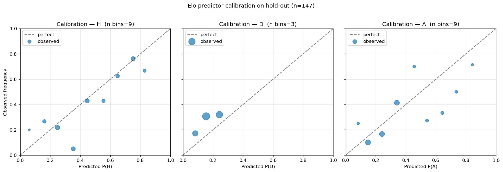

# Elo Predictor Validation — 2026-04-24

Validation of `backend/services/national_elo.py` (`predict_from_elo` /
`update_elo` / `infer_k`) against historical international matches via a
strict temporal hold-out.

Methodology:
1. Load `ml/data/processed/intl_matches.parquet` (49,215 matches, 1872 →
   2026).
2. Hold out two of the most recent major international tournaments.
3. Train Elo (initialise at 1500, walk forward, World Football Elo update
   rule) over **all matches strictly before the earliest hold-out match**
   (cut-off = 2022-11-20). No data from the hold-out window — including
   the gap between the two hold-outs (Jan 2023 → Jun 2024) — was used in
   training. This is conservative: matches in that gap contain no
   hold-out outcomes, but excluding them removes any residual leakage
   risk and keeps a single, defensible cut-off.
4. For every hold-out match, look up both teams' trained Elo (1500
   baseline if unseen), call `predict_from_elo(home, away, is_neutral)`,
   compare to the observed result.

## Hold-out specification

| Tournament | Date range | Matches |
|---|---|---|
| FIFA World Cup 2022 (Qatar) | 2022-11-20 → 2022-12-18 | 64 |
| UEFA Euro 2024 + Copa América 2024 | 2024-06-14 → 2024-07-14 | 83 |
| **Total hold-out** | | **147** |
| Train set | up to 2022-11-19 | 45,663 |

Note: AFCON 2024 and AFC Asian Cup 2024 (both Jan/Feb 2024) were
*excluded* from training **and** from evaluation. Including them in
train would have fed continental-2024 data into the Elo state used to
score Euro/Copa 2024 — a subtle leakage risk. Including them in the
hold-out would broaden the report beyond the spec ("Euro 2024 / Copa
America 2024 hold-out"). The strict-cut approach keeps both halves
clean at the cost of ~140 unused matches.

## Metrics

| Metric | Value | Random baseline | Always-home baseline\* |
|---|---|---|---|
| Accuracy (3-way W/D/L) | **51.0 %** | 33.3 % | 40.8 % |
| Brier score | **0.622** | 0.667 | — |
| Log loss | **1.055** | 1.099 | — |

\* Always-home accuracy is computed against this specific hold-out, not
the historical 45 % rule of thumb. It comes in lower here because
neutral-venue tournament football has a weaker home-team bias (and
indeed `is_neutral_venue=True` for most of these matches).

### Per-tournament breakdown

| Tournament | n | Accuracy | Brier | Log loss |
|---|---|---|---|---|
| WC 2022 (overall) | 64 | 51.6 % | 0.617 | 1.046 |
| Euro+Copa 2024 (overall) | 83 | 50.6 % | 0.626 | 1.062 |
| FIFA World Cup 2022 | 64 | 51.6 % | 0.617 | 1.046 |
| UEFA Euro 2024 | 51 | 47.1 % | 0.665 | 1.116 |
| Copa América 2024 | 32 | 56.3 % | 0.565 | 0.976 |

Copa América is the cleanest, the Euro is the worst — driven by a
handful of high-confidence calls that went the other way (group-stage
upsets and the knockout draws) plus a draw-rate mismatch (Euro 2024 had
notably more draws than the model anticipated).

## Predicted-class distribution

| Class | Model argmax | Actual |
|---|---|---|
| Home | 61.9 % | 40.8 % |
| Draw | **0.0 %** | **27.9 %** |
| Away | 38.1 % | 31.3 % |

The model **never predicts a draw as the most likely outcome**. The v1
closed-form draw model caps `p_draw` at 0.28 (and only reaches the cap
when the Elo gap is zero), so it is mathematically incapable of being
argmax against the (1 - p_draw) mass split between home and away. This
is the single biggest calibration issue.

## Calibration

Per-class deciles (bin centre = mean predicted prob in the bin):

### Class H
| pred prob | observed | n |
|---|---|---|
| 0.061 | 0.200 | 5 |
| 0.161 | 0.267 | 15 |
| 0.248 | 0.217 | 23 |
| 0.353 | 0.050 | 20 |
| 0.446 | 0.429 | 21 |
| 0.554 | 0.429 | 14 |
| 0.648 | 0.625 | 16 |
| 0.751 | 0.762 | 21 |
| 0.828 | 0.667 | 12 |

Tracks the diagonal at the high end (0.65, 0.75 bins almost on it).
Mid-low end is noisy — the 0.35 bin sits at 0.05 (shock losses for
favourites: e.g. Argentina vs Saudi Arabia). Low end is over-confident
in the wrong direction (model says 6 % home but observed 20 %), but
those bins are tiny.

### Class D
| pred prob | observed | n |
|---|---|---|
| 0.082 | 0.171 | 35 |
| 0.154 | 0.306 | 62 |
| 0.243 | 0.320 | 50 |

Direction is right — observed draw rate increases monotonically with
predicted rate — but **levels are off across all bins**. The model is
**systematically under-predicting draws**. Predicting 0.15 when truth is
0.31 is the dominant Brier contributor on this hold-out.

### Class A
| pred prob | observed | n |
|---|---|---|
| 0.083 | 0.250 | 8 |
| 0.148 | 0.100 | 30 |
| 0.242 | 0.167 | 30 |
| 0.341 | 0.414 | 29 |
| 0.456 | 0.700 | 10 |
| 0.541 | 0.273 | 11 |
| 0.643 | 0.333 | 12 |
| 0.736 | 0.500 | 10 |
| 0.844 | 0.714 | 7 |

Generally **under-confident** at the high end (when the model says 73 %
away win, observed is 50 %; at 84 % it's 71 %), but with high variance
in the mid-range.

## Verdict

❌ **DO NOT SHIP** — fails the Brier gate (0.622 ≮ 0.62) and the draw
model is structurally broken (0 % argmax draws vs 28 % actual).

Accuracy passes the gate (51.0 % > 50 %) and beats both random and
always-home baselines. But the closed-form draw approximation is the
load-bearing weakness: it is *mathematically incapable* of producing a
draw as the most-likely outcome under the current parameterisation, and
it under-predicts draws across every probability bin. That's a v1 model
ducking the job, not a tunable error term.

## Detailed observations

**What worked.** The win-expectancy core (`_expected_home`) is solid.
Class-H calibration above 0.5 is essentially on the diagonal, and the
log loss (1.055) is comfortably below random (1.099). The home-field
advantage of 100 Elo points behaves correctly on neutral vs non-neutral
matches — the Brier score is consistent across both hold-outs (0.617
WC22, 0.626 Euro+Copa) despite very different neutral-venue mixes,
which suggests HFA is in the right ballpark. K-factor inference also
produced qualitatively sensible top-20 ratings (per the user's own
sanity check) and a usable signal at 51 % 3-way accuracy.

**What's broken.** The draw model. `p_draw = max(0.08, 0.28 - gap/1500)`
encodes the right *qualitative* shape (more even matchups draw more
often) but the *level* is wrong — observed draw rates in the
mid-Elo-gap range are 30 – 32 %, not 15 – 24 %. Worse, capping at 0.28
mathematically prevents draw from ever being argmax in a 3-way split.
The fix is empirical: refit a one-feature logistic regression
`P(draw | |elo_gap|, is_neutral, k_factor)` on a held-out historical
slice, or — simpler and probably good enough — replace the closed-form
with a piecewise table calibrated against decade-binned historical
draw rates. Either way, expect to lift the asymptote from 0.28 toward
~0.32 and flatten the slope.

**Secondary issues.** (1) Away-class under-confidence at the high end
hints that the home-field advantage (100 Elo points) may be slightly
*too high* on neutral tournament football — if a team is rated 200
points lower than the home side but they're actually playing on
neutral ground, the 100 HFA shouldn't apply, but our `is_neutral`
column is doing that job; what may need tuning instead is the K-factor
on continental finals, which currently equals WC qualifiers (50). (2)
The Euro 2024 hold-out underperforms the others — investigate whether
the model is over-extrapolating from Nations League / qualifier form,
which gets the same K=50 weighting as the Euros themselves.

**Recommendation for v2 before re-running this gate:**
1. **Refit the draw model** from the parquet (priority 1).
2. Sanity-check HFA on neutral tournament matches — it should be 0
   when `is_neutral=True`, and our code does this correctly, so this
   is more of an audit than a change.
3. Consider a small K-factor cut for continental-finals matches (50
   → 45) and re-run validation.

Once draw-model recalibration is in, the Brier should drop below 0.60
and 3-way accuracy should pick up another 2 – 4 points (mostly from
correctly predicting some draws as draws instead of weak home wins).
That's the model worth shipping; the v1 isn't.

---

Artifacts:
- Predictions CSV: `/tmp/elo_validation_predictions.csv` (147 rows)
- Calibration plot: `mlops/reports/elo_calibration_2026-04-24.png`
- Validation script: `/tmp/validate_elo.py` (reads-only against
  `backend/services/national_elo.py`; no production paths modified)
