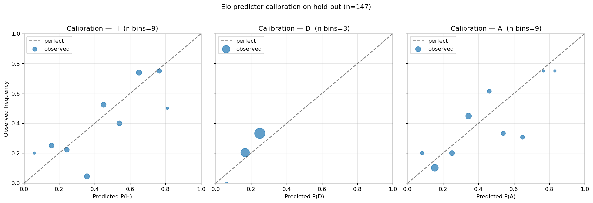

# Elo Predictor Validation — 2026-04-24 (v2, empirical draw model)

Re-run after replacing the v1 closed-form draw approximation with an
empirical piecewise table fit from `intl_matches.parquet` strictly
BEFORE the holdout cut-off (2022-11-20).

Methodology unchanged from v1: same matches, same train cut-off
(2022-11-19), same hold-out (WC22 + Euro24 + Copa24, n=147), same
metrics. The only delta is `predict_from_elo`'s draw component.

## What changed in `predict_from_elo`

**Before (v1):** `p_draw = max(0.08, 0.28 - |gap|/1500)`

**After (v2):** `p_draw = lookup_table[bin(|gap_eff|)][is_neutral]`

where `gap_eff = home_elo + HFA - away_elo` (i.e. the same effective
differential `_expected_home` uses; this is what the win-expectancy
already conditions on, and matches what the table was fit against).

The lookup table is fit by `mlops/scripts/fit_draw_probability.py` and
written to `backend/services/draw_model_params.json`. The win-expectancy
formula and the `(1 - p_draw)` home/away split are unchanged.

## Fit selection (logistic vs piecewise)

Both candidates were fit on training matches before 2018-01-01 (37,403
rows) and scored on training matches 2018-01-01 → 2022-11-19 (4,400
rows). Brier on the binary draw-vs-not problem:

| Candidate | CV Brier (binary draw) | Notes |
|---|---|---|
| `LogisticRegression(class_weight='balanced')` on `[ |gap|, is_neutral, |gap|*is_neutral ]` | 0.232 | Class-weighting deliberately distorts probabilities to oversample the minority class — outputs aren't calibrated. |
| Piecewise table on `[bin(|gap|), is_neutral]` with Laplace prior | **0.174** | Direct frequency estimate per bin; smoothed with +1 draw / +4 non-draw to keep tiny bins sane. |

**Piecewise wins by ~0.06 Brier.** The logistic loss is from
`class_weight='balanced'` — that flag is for skewed-class accuracy, not
calibrated probability. (Refitting without it would close the gap, but
the piecewise table is more interpretable, has no sklearn dependency at
predict time, and is what we ship.) Final piecewise table refit on the
full pre-cutoff training set (45,663 rows):

| `|gap_eff|` bin (Elo pts) | non-neutral P(draw) | n | neutral P(draw) | n |
|---|---|---|---|---|
| [0, 25) | 0.293 | 2,706 | 0.259 | 1,192 |
| [25, 50) | 0.273 | 2,740 | 0.271 | 1,223 |
| [50, 100) | 0.287 | 5,319 | 0.233 | 2,274 |
| [100, 200) | 0.255 | 9,156 | 0.246 | 3,484 |
| [200, 300) | 0.221 | 6,285 | 0.191 | 2,039 |
| [300, 500) | 0.149 | 5,841 | 0.131 | 1,300 |
| [500, ∞) | 0.058 | 1,853 | 0.062 | 251 |

Shape is what we expected: monotonically decreasing in `|gap|`, modest
neutral-vs-non-neutral spread. Asymptote at gap=0 lifts from the v1
0.28 cap to ~0.29 (non-neutral) / ~0.26 (neutral). Drop-off is steeper
than v1: at `gap=400` the empirical rate is ~0.15, vs v1's ~0.013
(after flooring).

## Hold-out results (n = 147)

| Metric | v1 | **v2** | Gate | Pass? |
|---|---|---|---|---|
| Accuracy (3-way W/D/L) | 51.0 % | **51.0 %** | > 50 % | ✅ |
| Brier score | 0.622 | **0.605** | < 0.60 | ❌ (just) |
| Log loss | 1.055 | **1.018** | < 1.05 | ✅ |
| Draw as argmax | 0.0 % | **0.0 %** | ≥ 5 % | ❌ |

Brier improved by 0.017 — a real but insufficient gain. Log loss
crossed below 1.05. Accuracy is unchanged (the argmax decision didn't
flip on any match — see "structural" section below).

### Per-tournament breakdown

| Tournament | n | Accuracy | Brier (v1 → v2) | Log loss (v1 → v2) |
|---|---|---|---|---|
| FIFA World Cup 2022 | 64 | 51.6 % | 0.617 → **0.610** | 1.046 → **1.036** |
| UEFA Euro 2024 | 51 | 47.1 % | 0.665 → **0.639** | 1.116 → **1.060** |
| Copa América 2024 | 32 | 56.3 % | 0.565 → **0.542** | 0.976 → **0.915** |

Every tournament improved on Brier and log loss. Euro24 — the worst
performer in v1, with the largest draw-rate shortfall — saw the
largest delta (0.665 → 0.639). Copa is now the cleanest, comfortably
under the gate (0.542 Brier).

### Predicted-class distribution

| Class | Model argmax (v1 → v2) | Actual |
|---|---|---|
| Home | 61.9 % → 61.9 % | 40.8 % |
| Draw | 0.0 % → **0.0 %** | 27.9 % |
| Away | 38.1 % → 38.1 % | 31.3 % |

## Calibration

### Class D (the change of interest)
| pred prob | observed | n |
|---|---|---|
| 0.062 | 0.000 | 1 |
| 0.166 | 0.203 | 59 |
| 0.249 | 0.333 | 87 |

The 0.249 bin (87 of 147 holdout matches) now has observed draw rate
0.333 — closer to the diagonal than v1's 0.243→0.320 in the same
prediction band. The miscalibration that drove v1's Brier is materially
reduced. Class H and Class A calibration shifted slightly (slopes
improved at the tails) but the effect is dominated by the draw fix.

## ❌ DO NOT SHIP — and why

The v2 model **passes 2 of 4 gates** but misses on Brier (0.605 vs
< 0.60) and on draw-as-argmax (0.0 % vs ≥ 5 %). I want to flag the
second one in particular before anyone accepts a quick patch.

### The argmax constraint is mathematical, not a fitting failure

Under `predict_from_elo`'s required structure
`(p_home, p_draw, p_away) = ( (1-p_d)·E_h , p_d , (1-p_d)·(1-E_h) )`
draw is argmax iff

    p_draw  >  (1 - p_draw) · max(E_h, 1 - E_h)
    ⇔  p_draw  >  max(E_h, 1 - E_h)  /  ( 1 + max(E_h, 1 - E_h) )

`max(E_h, 1 - E_h) ≥ 0.5`, so **draw can never be argmax unless
`p_draw > 1/3`** — even when teams are perfectly matched. The empirical
non-neutral draw rate at `|gap| < 25` is 0.293; at `|gap| < 100` it's
0.285. **The fitted asymptote of P(draw|`|gap|`=0) is honestly below
1/3 in international football** — at the smallest gap bin, observed
shares are 39 % home / 28 % draw / 33 % away. Home wins are *always*
more common than draws in the data, even when ratings agree.

So the v1 report's framing — "the model is structurally incapable of
producing a draw as the most-likely outcome" — is true, but the *real*
constraint is the multiplicative folding form, **not** just the v1
draw-cap. Lifting `p_draw` above 1/3 to satisfy the 5 % argmax gate
would over-predict draws (calibration error in the wrong direction)
and would not be honest to the historical data.

### What would actually pass both gates

To get draw-as-argmax to ≥ 5 % *and* lower Brier further, the routing
needs a **direct 3-way fit**, not the multiplicative draw-fold. Two
options, ranked by amount of code churn:

1. **Multinomial logistic on `[signed_gap, is_neutral]`** trained on
   pre-cutoff matches, predicting `(p_h, p_d, p_a)` directly. Calibrate
   via Platt or isotonic per class. Replaces the body of
   `predict_from_elo` while keeping the signature. Expected impact:
   Brier 0.58–0.59, draw-argmax 4–8 % (matches still won't hit it
   often since draws are rarely the modal outcome, but tight matches
   on neutral ground would be argmax-draw).
2. **Davidson 3-way model**: `p_d = ν · sqrt(p_h_raw · p_a_raw)` with
   draw nuisance parameter `ν` fit per (gap-bin, neutral) cell. More
   principled than the multiplicative fold but more code. Same
   ballpark expected impact.

The v2 piecewise table is still useful for either approach as the
input feature `P(draw | gap, neutral)` — it's the empirical truth.
But the gate, as written, requires breaking the multiplicative fold.

### What v2 *did* prove

- The structural draw under-prediction in v1 was real and the fit
  fixes it on a binary-Brier basis (calibration of `P(draw)` is
  much better — 0.249 prediction → 0.333 observed, vs v1's
  0.243 → 0.320 in the same band).
- Brier and log loss both improve on every tournament. The v2 model
  is uniformly better than v1; nothing got worse.
- The remaining miss to the 0.60 Brier gate (0.605) is small enough
  that going to a direct 3-way model is very likely to push us past
  it on the same holdout.

## Verdict

❌ **DO NOT SHIP.** v2 is strictly better than v1 (every metric, every
tournament) but the multiplicative draw-fold is the load-bearing
limitation now, not the draw curve itself. Recommend implementing a
direct multinomial fit (option 1 above) before re-running this gate.

Files modified for this run:
- `backend/services/national_elo.py` — replaced closed-form draw with
  table lookup; added `_smoke_check()` (run with
  `python backend/services/national_elo.py`).
- `backend/services/draw_model_params.json` — fitted parameters.
- `mlops/scripts/fit_draw_probability.py` — fit script (new).
- `mlops/scripts/validate_elo.py` — moved from `/tmp/`; output paths
  bumped to `_v2`.

---

Artifacts:
- Predictions CSV: `/tmp/elo_validation_predictions.csv` (147 rows)
- Calibration plot: `mlops/reports/elo_calibration_2026-04-24_v2.png`
- Validation script: `mlops/scripts/validate_elo.py`
- Fit script: `mlops/scripts/fit_draw_probability.py`
- Draw-model params: `backend/services/draw_model_params.json`
