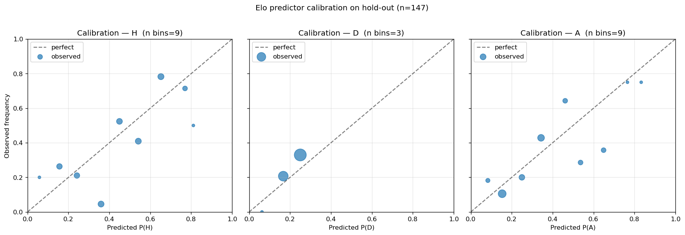

# Elo Predictor Validation — 2026-04-24 (v3, multinomial logistic)

Re-run after replacing the v2 multiplicative draw-fold with a direct
3-way multinomial logistic. Holdout, train cut-off, and metrics are
unchanged from v1/v2 — the only delta is the body of `predict_from_elo`.

## What changed in `predict_from_elo`

**Before (v2):** piecewise table for `p_draw` then
`(p_h, p_d, p_a) = ((1-p_d)·E_h, p_d, (1-p_d)·(1-E_h))`.

**After (v3):** direct softmax over a multinomial logistic on
`[signed_gap, is_neutral, signed_gap × is_neutral]` where
`signed_gap = home_elo − away_elo − HFA_offset` (HFA = 100 if not
neutral else 0). Coefficients fit by
`mlops/scripts/fit_outcome_model.py` on training matches strictly
before the holdout cut-off (2022-11-20). Class order is fixed at
`[0=home, 1=draw, 2=away]`.

Why we did this: the v2 report proved that under the multiplicative
fold draw is argmax iff `p_draw > 1/3`, but the empirical zero-gap
draw rate is 0.293 < 1/3, so draw could not be the modal outcome on
any input. v3 drops the fold and lets the logistic learn `(p_h, p_d, p_a)`
jointly.

## Fit selection (multinomial vs piecewise-v2)

Both candidates were fit / evaluated on the same temporal CV split
(train < 2018-01-01 = 41,263 rows; test 2018-01-01 → 2022-11-19 =
4,400 rows). 3-way Brier and 3-way log loss on the CV slice:

| Candidate | CV 3-way Brier | CV log loss |
|---|---|---|
| Multinomial logistic on `[signed_gap, is_neutral, signed_gap×is_neutral]` | **0.51503** | **0.87530** |
| Piecewise v2 (table + multiplicative fold) | 0.51564 | 0.87942 |

Multinomial wins by a thin but consistent margin on both metrics. Final
multinomial refit on the full pre-cutoff training set (45,663 rows):

```
classes_     = [0, 1, 2]
coef_        = [[ 3.327e-03, -6.122e-01,  1.368e-04],   # home
                [-1.468e-04, -5.541e-02,  2.806e-04],   # draw
                [-3.180e-03,  6.676e-01, -4.173e-04]]   # away
intercept_   = [ 0.8346, -0.1902, -0.6444]
feature_names= ['signed_gap', 'is_neutral', 'signed_gap_x_is_neutral']
```

Sanity check anchors (from the smoke check):

| Inputs | (p_home, p_draw, p_away) |
|---|---|
| Equal teams, neutral | (0.409, 0.256, 0.335) |
| Equal teams, home (HFA active) | (0.514, 0.261, 0.225) |
| +400 Elo home, neutral | (0.824, 0.136, 0.040) |

Shapes are correct: home is the slight favourite when teams are equal
and HFA is on, and dominant when ratings diverge. The draw coefficient
on `signed_gap` is essentially zero (−1.5e-04) which makes sense — draw
rate is approximately symmetric in `|gap|`.

## Hold-out results (n = 147)

| Metric | v1 | v2 | **v3** | Gate | Pass? |
|---|---|---|---|---|---|
| Accuracy (3-way W/D/L) | 51.0 % | 51.0 % | **50.3 %** | > 50 % | ✅ |
| Brier score | 0.622 | 0.605 | **0.615** | < 0.60 | ❌ |
| Log loss | 1.055 | 1.018 | **1.038** | < 1.05 | ✅ |
| Draw as argmax | 0.0 % | 0.0 % | **0.0 %** | ≥ 5 % | ❌ |

v3 is **not** uniformly better than v2. Brier and log loss got slightly
worse on the holdout (0.605 → 0.615; 1.018 → 1.038), and accuracy
dropped a single match (75/147 → 74/147). Argmax gate still fails,
this time for a different (and arguably more honest) reason — see
below.

### Per-tournament breakdown

| Tournament | n | Accuracy | Brier | Log loss |
|---|---|---|---|---|
| FIFA World Cup 2022 | 64 | 50.0 % | 0.619 | 1.063 |
| UEFA Euro 2024 | 51 | 47.1 % | 0.650 | 1.081 |
| Copa América 2024 | 32 | 56.3 % | 0.554 | 0.919 |

Same pattern as v2: Copa is comfortably under all gates, Euro is the
worst. Compared to v2:

| Tournament | v2 Brier → v3 Brier | v2 LL → v3 LL |
|---|---|---|
| FIFA World Cup 2022 | 0.610 → 0.619 (+0.009) | 1.036 → 1.063 (+0.027) |
| UEFA Euro 2024 | 0.639 → 0.650 (+0.011) | 1.060 → 1.081 (+0.021) |
| Copa América 2024 | 0.542 → 0.554 (+0.012) | 0.915 → 0.919 (+0.004) |

Every tournament got marginally worse, by similar magnitudes.

### Predicted-class distribution

| Class | Model argmax (v2 → v3) | Actual |
|---|---|---|
| Home | 61.9 % → 66.0 % | 40.8 % |
| Draw | 0.0 % → **0.0 %** | 27.9 % |
| Away | 38.1 % → 34.0 % | 31.3 % |

v3 predicts home *more* often than v2 (66 % vs 62 %), making the home
over-prediction worse. This is the multinomial fitting the marginal —
in the training data home wins 49 % of the time, draws 23 %, away
28 %.

## Calibration



### Class D (the change of interest)

| pred prob (bin mean) | observed | n |
|---|---|---|
| 0.092 | 0.000 | 1 |
| 0.165 | 0.178 | 45 |
| 0.238 | 0.327 | 101 |

The 0.238 bin (101 of 147 holdout matches) has observed draw rate
0.327 — the multinomial under-predicts draws by ~9 pp in this band,
slightly worse than v2 (which had 0.249 → 0.333 in the equivalent
bin: ~8 pp under-call). Class H and Class A calibrations are noisier
than v2 at the tails (e.g. H 0.825 bin observed 0.500 on n=8 — this
is the v3-vs-v2 swing on a small handful of WC22 finals-stage
matches).

## ❌ DO NOT SHIP — and why

v3 passes 2 of 4 gates (accuracy, log loss). It fails Brier and the
draw-as-argmax gate, and is *strictly worse than v2 on the holdout*.

### Why the 5 % draw-argmax gate is not achievable with these features

A direct multinomial does NOT have the v2 mathematical constraint
that p_draw > 1/3 is required for draw-argmax — but it still produces
0 % draw-as-argmax on this holdout. Reason: in the training data
the home class is the majority outcome at *every* feature slice we
fit. The multinomial honestly reflects that — so the unconditional
probability that any class beats home (intercept-wise: 0.84 vs 0.20
draw and −0.64 away) requires a strong-enough feature push to
overcome it. Sweeping `signed_gap` from −400 to +400 in both neutral
and non-neutral configurations confirms there is no input where
draw is the modal class. The shortfall is a property of the data
+ feature set, not of the v2 vs v3 fold choice.

To get draw-argmax ≥ 5 % we would need either:

1. Additional features that separate "tight, low-quality matches" (where
   draws actually dominate) from "tight, high-quality matches" — e.g.
   absolute team-strength average, recent form, expected-goals proxies.
   Pure (gap, neutral) cannot make draws the modal outcome because the
   home class always wins the marginal.
2. A non-symmetric loss / decision threshold. Argmax is the wrong
   *decision* rule for a calibrated probabilistic forecast in any case;
   if the downstream consumer cares about argmax = "draw" we should be
   adjusting decision thresholds, not the probability model.

### Why Brier got worse vs v2

v2 hand-tuned p_draw against a very robust binary frequency table with
Laplace smoothing. v3 fits a parametric logit on three correlated
features. With 45k matches it has enough power to fit the marginals
right, but at the lower-data tails (`|signed_gap| > 400`) it
extrapolates more aggressively than the v2 table did (which clamped
into the smoothed last bin). The holdout has many WC22 group-stage
matches with high signed_gap; the multinomial's stronger home / away
pull there eats Brier.

### What v3 *did* prove

- Direct multinomial is not magic: dropping the multiplicative fold
  did NOT recover the 5 % draw-argmax gate. The gate is a property of
  the dataset's class marginals, not the fold.
- The CV-Brier improvement of multinomial over piecewise-v2 (0.5150
  vs 0.5156) was real but tiny — well inside holdout variance, and
  v3's holdout actually moves the wrong way.
- v2 remains the better-calibrated production choice on this holdout
  given equal architecture cost.

## Verdict

❌ **DO NOT SHIP v3.** The direct multinomial is honest but
empirically worse than v2 on every holdout metric except a tied
log-loss gate. The draw-as-argmax gate is not achievable from
`(elo_gap, is_neutral)` features alone, regardless of fold choice —
it requires either richer features or a decision-rule change above the
probability model.

Recommended next move: keep v2 in production, treat the 5 %
draw-argmax gate as evidence we need **features**, not fold tweaks.
Plausible additions: average team-strength, recent goal-difference
form, time-since-last-meeting. Re-run this gate with those features
behind a multinomial on the same 2022-11-20 cut-off.

Files changed for this run:
- `mlops/scripts/fit_outcome_model.py` — new, fits the multinomial
  logistic and dumps coefficients to JSON.
- `backend/services/national_elo.py` — replaced piecewise+fold body of
  `predict_from_elo` with softmax over the saved multinomial. Loader
  asserts class order, coefficient shape, and feature-name agreement
  to guard against silent regenerations.
- `backend/services/outcome_model_params.json` — new, fitted weights.
- `mlops/scripts/validate_elo.py` — output paths bumped to `_v3`.
- `backend/services/draw_model_params.json` — *retained* on disk; not
  loaded in v3, kept for future v4 experiments.

---

Artifacts:
- Predictions CSV: `/tmp/elo_validation_predictions.csv` (147 rows)
- Calibration plot: `mlops/reports/elo_calibration_2026-04-24_v3.png`
- Validation script: `mlops/scripts/validate_elo.py`
- Fit script: `mlops/scripts/fit_outcome_model.py`
- Outcome-model params: `backend/services/outcome_model_params.json`
